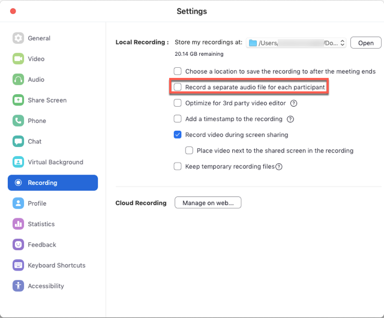

 
# Recording Remote Interviews using Zoom
Many podcasters use Zoom.us to record their sessions if the co-host or interviewee is not in the same location. Zoom gives you higher audio quality than you’ll get on a regular phone call and in addition, you can have calls with multiple people at once.

If you have any questions or get stuck as you work through this in-class exercise, please ask the instructor for assistance.  Have fun!

1. Key Zoom limitation & features of the free version:
- 40-minute limit on meetings & recordings with 3 or more participants. As a UVic student, you have access to the paid version by logging on to Zoom via [https://uvic.zoom.us](https://uvic.zoom.us){:target="_blank"} 
- No time limit on 1 to 1 meetings & recordings.
- Host recordings of up to 100 participants.
- Record audio, video, and desktop sharing.

2. Create a Zoom.us account
- Go to the [Zoom.us](https://uvic.zoom.us){:target="_blank"} website and click on the blue **SIGNUP, IT’S FREE** button on the top right.
- Create a Zoom account with your email address or with your Google or Facebook account. 

3. Setting up Zoom:  
- On the main Zoom.us webpage, click on the **HOST A MEETING** drop down box on the top right of the web page, and then select, **With Video On**.
- If this is your first Zoom meeting, you will be prompted to **download** and **install** a small program. 
- You will then be asked if you want to join a meeting. Press the **Cancel** button.
- **Enter** the **email address** of the person you want to interview, and **press** the **I’m not a robot** checkbox, then **press** the orange **Invite** button. This will send an invite to them to joint Zoom which they will have to accept.
- Once the interviewee has accepted the invite and created a Zoom account, or logged on to their existing zoom account, you can then invite them to a “meeting” where you can record your interview with them.

4. Zoom Settings for Interviews:  
- Open the Zoom client and click Settings (or Zoom -> Preferences on the top menu of a Mac).
- Click the Recording tab on the left.
- Enable Record a separate audio file for each participant.

5. Interviewing with Zoom:
- On the main Zoom.us webpage, **click** on the **HOST A MEETING** drop down box on the top right of the web page, and then select, **With Video On**.
- A popup box will appear with the title **Open zoom.us**. **Click** on the Open **zoom.us** button. This launches the Zoom program on your computer with your laptop’s camera turned on.  
- **Click** on the **Invite** button at the bottom of the window, and then **click** on the **Copy URL** text on the bottom left of the screen.
- Message your interviewee either by email or instant message and **paste** in the **URL** you just copied which will look something like this: https://zoom.us/j/532670881?pwd=Yyt3ZVZjQ2VFdzBCd21wN2s2QUVGUT09. When your interviewee clicks on the link it will ask them if they would like to join your meeting.
  
- Once they have joined your meeting, let them know that you are going to start recording, and then **click** on the **Record** button on the bottom right of the Zoom window.
- If you haven’t already, **put on some headphones** so that you can make sure that the audio levels from your end and your interviewees end sound good. 
- You may need to adjust your audio input settings, and you may need to walk your participant through how to do the same. It can be helpful to ask your interviewee to share their screen with you in order to adjust their audio levels.
      - Windows: **Windows Settings -> System -> Sound -> Input**.
      - OSX: **System Preferences -> Sound -> Input -> Input Volume**.
- Once everything sounds good, start your interview proper and officially welcome your guest. 
- You can always edit out the introduction where you are getting everything set up, but you never know, you might record something interesting with your interviewee while taking care of pre-podcast technical details.

6. Ending the interview & importing the interview audio into Audacity:  
- To end the recording of the interview **mouse over** the **Recording** text on the top left of the Zoom screen (see right) and then **press** the white square **stop icon**.
- End the meeting by **pressing** the red **End Meeting** text at the bottom right of the Zoom screen (you may need to move your mouse to the Zoom screen to see the text).
- A dialogue box will appear. **Press** the **End Meeting for All** button.
- Another dialogue box will appear asking you where you want Zoom to save the recordings from the meeting on your local hard drive. **Select a location** where you will be able to easily find the files and **press** the **Save** button.
- A folder with the location you selected should now appear.
- **Open Audacity. Drag and drop** the **m4a** file in the folder that Zoom opened for you **into Audacity**. If you get an error message you will need to install the ffmpeg driver that will allow you to import this file into Audacity.
- Now you’re ready to edit the interview! 

Great Job and Happy interviewing! 

[NEXT STEP: Publishing Single Audio Interviews](publishing-single-audio-interviews.html){: .btn .btn-blue }
